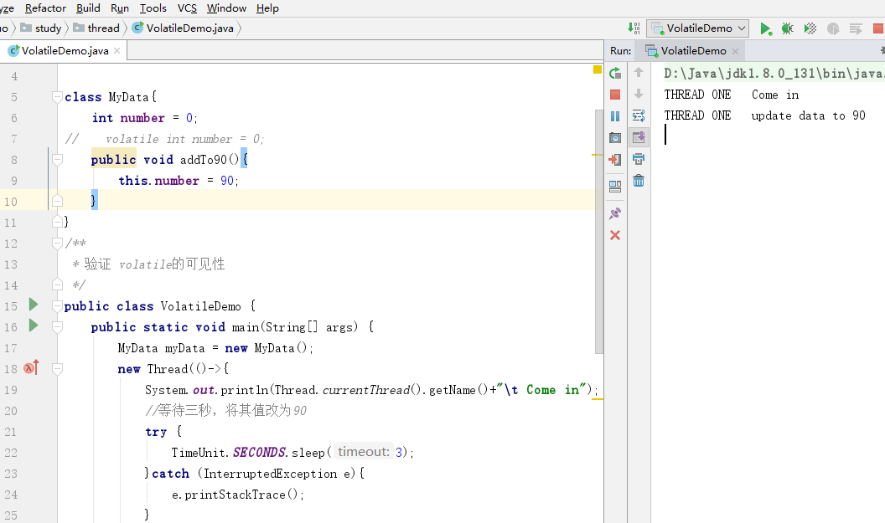
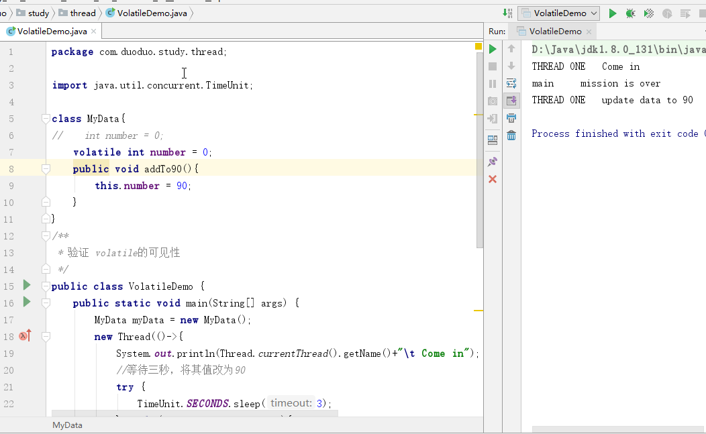
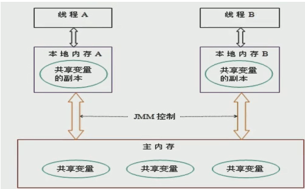
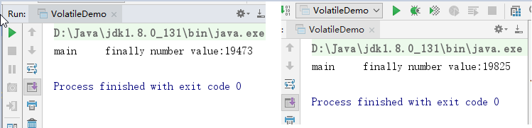
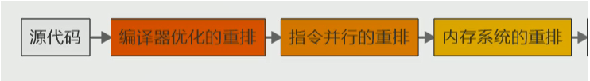
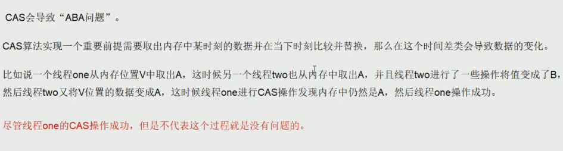
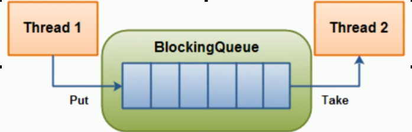
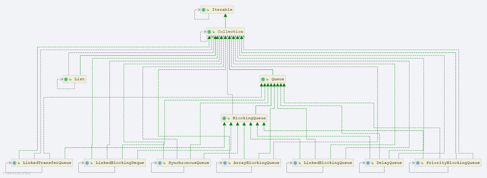
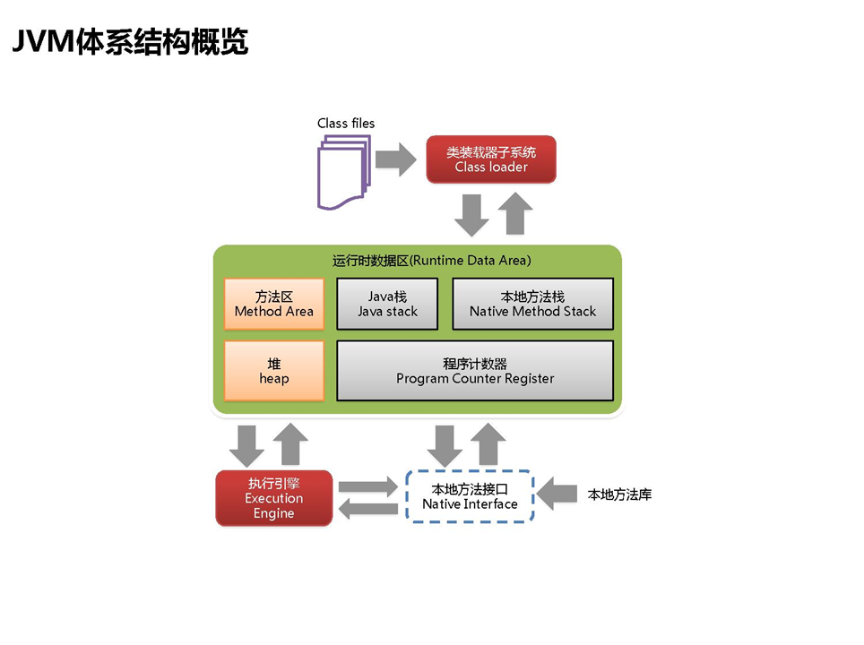

此文档为徐员外2019年10月1日期间学习总结, 代码及相关文档已上传至 

github：https://github.com/joehochina/guoqin


# 一、Volatile 三大特性

此知识点在多线程程序中出现

## 1.1 保持可见性

在多个线程中，使用volatie修饰的变量、方法，对其他线程可见

测试代码

```java
package com.duoduo.study.thread;
import java.util.concurrent.TimeUnit;

class MyData{
    int number = 0;
   // volatile int number = 0;
    public void addTo90(){
        this.number = 90;
    }
}
/**
 * 验证 volatile的可见性
 */
public class VolatileDemo {
    public static void main(String[] args) {
        MyData myData = new MyData();
        new Thread(()->{
            System.out.println(Thread.currentThread().getName()+"\t Come in");
            //等待三秒，将其值改为90
            try {
                TimeUnit.SECONDS.sleep(3);
            }catch (InterruptedException e){
                e.printStackTrace();
            }
            myData.addTo90();
            System.out.println(Thread.currentThread().getName()+"\t update data to "+myData.number);
        },"THREAD ONE").start();
        
       //此时number变量没有加volatile关键字，上面线程做的修改对main线程不可见，程序执行“THREAD ONE"线程后挂起下面代码不执行.
        // volatile int number = 0; 当加上volatile关键字后，下面代码正常执行
        while (myData.number == 0){
        }        
        System.out.println(Thread.currentThread().getName()+"\t mission is over");
    }
}

```

**运行结果：此时number变量没有加volatile关键字,运行的情况**



**运行结果：加上volatile关键字后，number对main线程可见**



 涉及知识点：JMM(Java memories model)

JMM(Java内存模型Java Memory Model,简称JMM)本身是一种抽象的概念 并不真实存在,它描述的是一组规则或规范通过规范定制了程序中各个变量(包括实例字段,静态字段和构成数组对象的元素)的访问方式.
JMM关于同步规定:
1.线程解锁前,必须把共享变量的值刷新回主内存
2.线程加锁前,必须读取主内存的最新值到自己的工作内存
3.加锁解锁是同一把锁

由于JVM运行程序的实体是线程,而每个线程创建时JVM都会为其创建一个工作内存(有些地方成为栈空间),工作内存是每个线程的私有数据区域,而Java内存模型中规定所有变量都存储在主内存,主内存是共享内存区域,所有线程都可访问,但线程对变量的操作(读取赋值等)必须在工作内存中进行,首先要将变量从主内存拷贝到自己的工作空间,然后对变量进行操作,操作完成再将变量写回主内存,不能直接操作主内存中的变量,各个线程中的工作内存储存着主内存中的变量副本拷贝,因此不同的线程无法访问对方的工作内存,此案成间的通讯(传值) 必须通过主内存来完成,其简要访问过程如下图:



## 1.2 不保持原子性

 **原子性指的是什么？**

不可分割，完整性，也就是某个线程在执行某个具体业务的时候，中间不可分割，要么完整执行成功，要么同时失败。

```java
package com.duoduo.study.thread;
import java.util.concurrent.TimeUnit;

class MyData{
//    int number = 0;
    volatile int number = 0;
    public void addTo90(){
        this.number = 90;
    }
    public void addPlus(){
        this.number++;
    }
}
/**
 * 验证 volatile的可见性
 * 1.加volatile光健字
 *
 * 验证volatile不保证原子性
 *  原子性的含义
 */
public class VolatileDemo {
    public static void main(String[] args) {
//        seeOkByVolatile();
        MyData myData = new MyData();
        for (int i = 1; i <=20 ; i++) {
            new Thread(()->{
                for (int j = 1; j <=1000 ; j++) {
                    myData.addPlus();
                }
            },String.valueOf(i)).start();
        }
        //需要等待20个线程全部执行完成后，再用main线程取得最终的更新结果
//        try {
//            TimeUnit.SECONDS.sleep(5);
//        }catch (InterruptedException e){
//            e.printStackTrace();
//        }
        while (Thread.activeCount()>2){
            Thread.yield();
        }
        System.out.println(Thread.currentThread().getName()+"\t finally number value:"+myData.number);
    }   
}
```

**执行程序之后，会发现程序每次执行的结果都不一样**




1、此时要想保持原子性，即每次的执行结果保持一致，可以在 addPlus()方法前加**synchronized** 关键字,由此可见，volatile不保证原子性

```java
    public synchronized void addPlus(){
        this.number++;
    }
```

2、使用juc 包下的AtomicInteger类来定义变量，保持原子性

```JAVA
package com.duoduo.study.thread;

import java.util.concurrent.TimeUnit;
import java.util.concurrent.atomic.AtomicInteger;

class MyData{
//    int number = 0;
    volatile int number = 0;
    public void addTo90(){
        this.number = 90;
    }
    //保持原子性的方式一
//    public synchronized void addPlus(){
//        this.number++;
//    }
    public  void addPlus(){
        this.number++;
    }
    //保持原子性的方式二
    AtomicInteger atomicInteger = new AtomicInteger();
    public void addAtomic(){
        atomicInteger.getAndIncrement();
    }
}
/**
 * 验证 volatile的可见性
 * 1.加volatile光健字
 *
 * 验证volatile不保证原子性
 *  原子性的含义
 *  1、加synchronized关键字
 *  2、使用AtomicInteger定义
 */
public class VolatileDemo {
    public static void main(String[] args) {
//        seeOkByVolatile();
        MyData myData = new MyData();
        for (int i = 1; i <=20 ; i++) {
            new Thread(()->{
                for (int j = 1; j <=1000 ; j++) {
                    myData.addPlus();
                    myData.addAtomic();
                }
            },String.valueOf(i)).start();
        }
        //需要等待20个线程全部执行完成后，再用main线程取得最终的更新结果
//        try {
//            TimeUnit.SECONDS.sleep(5);
//        }catch (InterruptedException e){
//            e.printStackTrace();
//        }
        while (Thread.activeCount()>2){
            Thread.yield();
        }
        System.out.println(Thread.currentThread().getName()+"\t finally number value:"+myData.number);
        System.out.println(Thread.currentThread().getName()+"\t atomicInteger finally number value:"+myData.atomicInteger );
    }

    //验证volatile保证可见性
    private static void seeOkByVolatile() {
        MyData myData = new MyData();
        new Thread(()->{
            System.out.println(Thread.currentThread().getName()+"\t Come in");
            //等待三秒，将其值改为90
            try {
                TimeUnit.SECONDS.sleep(3);
            }catch (InterruptedException e){
                e.printStackTrace();
            }
            myData.addTo90();
            System.out.println(Thread.currentThread().getName()+"\t update data to "+myData.number);
        },"THREAD ONE").start();
        while (myData.number == 0){
        }
        System.out.println(Thread.currentThread().getName()+"\t mission is over");
    }
}
```


## 1.3 禁止指令重排

有序性 概念

计算机在执行程序时,为了提高性能,编译器和处理器常常会做指令重排,一把分为以下3中




单线程环境里面确保程序最终执行结果和代码顺序执行的结果一致.
处理器在进行重新排序是必须要考虑指令之间的数据依赖性

多线程环境中线程交替执行,由于编译器优化重排的存在,两个线程使用的变量能否保持一致性是无法确定的,结果无法预测

```java
/**
 * 多线程环境中线程交替执行,由于编译器优化重排的存在,
 * 两个线程使用的变量能否保持一致性是无法确定的,结果无法预测
 * 使用Volatile可以禁止指令重排
 */
public class ResortSeqDemo {
    int a=0;
    boolean flag = false;
    public void mehtod_01(){
        a =1;
        flag = true;
    }
    public void method_02(){
        if(flag){
            a = a+5;
            System.out.println("retValue"+a);
        }
    }
}
```

# 二、Volatile的使用场景

## 2.1单例模式指令重排代码

```java
package com.duoduo.study.thread;

public class SingletonDemo {
    private static volatile SingletonDemo instance = null;
    private SingletonDemo(){
        System.out.println(Thread.currentThread().getName()+"\t 我是构造方法 SingletonDemo（）");
    }
    //在高并发模式下加 synchronized
   //DCL(double check lock 双端检锁机制)
    public static  SingletonDemo getInstance(){
        if(instance == null) {
            synchronized (SingletonDemo.class){
                if(instance==null){
                    instance = new SingletonDemo();
                }
            }
        }
        return instance;
    }
    public static void main(String[] args) {

        for (int i = 1; i <10 ; i++) {
            new Thread(()->{
                System.out.println(SingletonDemo.getInstance()==SingletonDemo.getInstance());
            },String.valueOf(i)).start();
        }

    }
}

```

DCL(双端检锁) 机制不一定线程安全,原因是有指令重排的存在,加入volatile可以禁止指令重排
  原因在于某一个线程在执行到第一次检测,读取到的instance不为null时,instance的引用对象可能没有完成初始化.
instance=new SingletonDem(); 可以分为以下步骤(伪代码)

memory=allocate();//1.分配对象内存空间
instance(memory);//2.初始化对象
instance=memory;//3.设置instance的指向刚分配的内存地址,此时instance!=null 

步骤2和步骤3不存在数据依赖关系.而且无论重排前还是重排后程序执行的结果在单线程中并没有改变,因此这种重排优化是允许的.
memory=allocate();//1.分配对象内存空间
instance=memory;//3.设置instance的指向刚分配的内存地址,此时instance!=null 但对象还没有初始化完.
instance(memory);//2.初始化对象
但是指令重排只会保证串行语义的执行一致性(单线程) 并不会关心多线程间的语义一致性
所以当一条线程访问instance不为null时,由于instance实例未必完成初始化,也就造成了线程安全问题.

#  三、CAS(compare and Swap)指令重排

## **3.1代码**

```java
package com.duoduo.study.thread;

import java.util.concurrent.atomic.AtomicInteger;

public class CASDemo {
    public static void main(String[] args) {
        AtomicInteger atomicInteger = new AtomicInteger(5);
        System.out.println(atomicInteger.compareAndSet(5,2019));
        System.out.println(atomicInteger.compareAndSet(5,2016));
    }
}

```

## **3.2底层原理 unsafe** 

```java
public class AtomicInteger extends Number implements java.io.Serializable {
    private static final long serialVersionUID = 6214790243416807050L;

    // setup to use Unsafe.compareAndSwapInt for updates
    private static final Unsafe unsafe = Unsafe.getUnsafe();
    private static final long valueOffset;

    static {
        try {
            valueOffset = unsafe.objectFieldOffset
                (AtomicInteger.class.getDeclaredField("value"));
        } catch (Exception ex) { throw new Error(ex); }
    }

```

1.Unsafe 是CAS的核心类 由于Java 方法无法直接访问底层 ,需要通过本地(native)方法来访问,UnSafe相当于一个后面,基于该类可以直接操作特额定的内存数据.UnSafe类在于sun.misc包中,其内部方法操作可以向C的指针一样直接操作内存,因为Java中CAS操作的助兴依赖于UNSafe类的方法.
**注意UnSafe类中所有的方法都是native修饰的,也就是说UnSafe类中的方法都是直接调用操作底层资源执行响应的任务**
 2.变量ValueOffset,便是该变量在内存中的偏移地址,因为UnSafe就是根据内存偏移地址获取数据的

 ```java
/**
var1 AtomicInteger对象本身.
var2 该对象值的引用地址
var4 需要变动的数值
var5 是用过var1 var2找出内存中绅士的值
用该对象当前的值与var5比较
如果相同,更新var5的值并且返回true
如果不同,继续取值然后比较,直到更新完成
*/
/**
     * Atomically increments by one the current value.
     *
     * @return the previous value
     */
    public final int getAndIncrement() {
        return unsafe.getAndAddInt(this, valueOffset, 1);
    }

/**************************************************************************/
    public final int getAndAddInt(Object var1, long var2, int var4) {
        int var5;
        do {
            var5 = this.getIntVolatile(var1, var2);
        } while(!this.compareAndSwapInt(var1, var2, var5, var5 + var4));

        return var5;
    }
 ```

3.变量value和volatile修饰,保证了多线程之间的可见性.

## 3.3CAS缺点

循环do....while 开销大

只能保证一个共享变量的原子操作

引出ABA问题


# 四、原子类AtomicInteger的ABA问题

​		

## **4.1原子引用**

```java
package com.duoduo.study.thread;
import java.util.concurrent.atomic.AtomicReference;

class User{
    String userName;
    int age;

    public User() {
    }

    public User(String userName, int age) {
        this.userName = userName;
        this.age = age;
    }

    @Override
    public String toString() {
        return "User{" +
                "userName='" + userName + '\'' +
                ", age=" + age +
                '}';
    }

    public int getAge() {
        return age;
    }

    public void setAge(int age) {
        this.age = age;
    }

    public String getUserName() {
        return userName;
    }

    public void setUserName(String userName) {
        this.userName = userName;
    }
}
public class AtomicReferenceDemo {
    public static void main(String[] args) {
        User zs = new User("zs", 22);
        User ls = new User("ls", 22);
        AtomicReference<User> userAtomicReference = new AtomicReference<>();
        userAtomicReference.set(zs);
        System.out.println(userAtomicReference.compareAndSet(zs, ls)+"\t"+userAtomicReference.get().toString());
        System.out.println(userAtomicReference.compareAndSet(zs, ls)+"\t"+userAtomicReference.get().toString());
    }
}

```

## **4.2时间戳原子引用**

```java
package com.duoduo.study.thread;

import java.util.concurrent.TimeUnit;
import java.util.concurrent.atomic.AtomicReference;
import java.util.concurrent.atomic.AtomicStampedReference;

public class ABADemo {
    static AtomicReference<Integer> atomicReference = new AtomicReference<>(100);
    static AtomicStampedReference<Integer> atomicStampedReference = new AtomicStampedReference<>(100,2019);

    public static void main(String[] args) {
        System.out.println("==============以下是ABA问题的产生========");

        new Thread(()->{
            atomicReference.compareAndSet(100,101);
            atomicReference.compareAndSet(101,100);

        },"t1").start();

        new Thread(()->{
            //暂停线程1秒钟,保证t1完成ABA操作
            try {
                TimeUnit.SECONDS.sleep(1);
            }catch (InterruptedException e){e.printStackTrace();}
            System.out.println(atomicReference.compareAndSet(100,2019)+"\t"+atomicReference.get());

        },"t2").start();
        System.out.println("==============以下是ABA问题的解决========");
        new Thread(()->{
            int stamp = atomicStampedReference.getStamp();
            System.out.println(Thread.currentThread().getName()+"\t第1次版本号："+stamp);
            try {
                TimeUnit.SECONDS.sleep(1);
            }catch (InterruptedException e){e.printStackTrace();}
            atomicStampedReference.compareAndSet(100,101,atomicStampedReference.getStamp(),atomicStampedReference.getStamp()+1);
            System.out.println(Thread.currentThread().getName()+"\t第2次版本号："+atomicStampedReference.getStamp());
            atomicStampedReference.compareAndSet(101,100,atomicStampedReference.getStamp(),atomicStampedReference.getStamp()+1);
            System.out.println(Thread.currentThread().getName()+"\t第3次版本号："+atomicStampedReference.getStamp());
        },"t3").start();

        new Thread(()->{
            int stamp = atomicStampedReference.getStamp();
            System.out.println(Thread.currentThread().getName()+"\t第1次版本号："+atomicStampedReference.getStamp());
            try {
                TimeUnit.SECONDS.sleep(3);
            }catch (InterruptedException e){e.printStackTrace();}
            boolean result=atomicStampedReference.compareAndSet(100,2019,stamp,stamp+1);
            System.out.println(Thread.currentThread().getName()+"修改成功与否"+result+"\t当前实际版本号："+atomicStampedReference.getStamp());
            System.out.println(Thread.currentThread().getName()+"\t当前实际最新值："+atomicStampedReference.getReference());
        },"t4").start();
    }
}

```

# 五、集合类不安全的问题

```java
package com.duoduo.study.thread;

import java.util.*;
import java.util.concurrent.CopyOnWriteArrayList;

/**
 * 集合类线程不安全的问题
 */
public class ContainerNotSafeDemo {
    public static void main(String[] args) {
//        List<String> list = new Vector<>();//ArrayList<>();
//        List<String> list = Collections.synchronizedList(new ArrayList<>());
        List<String> list = new CopyOnWriteArrayList<>();

        for (int i = 1; i <30 ; i++) {
            new Thread(()->{
                list.add(UUID.randomUUID().toString().substring(0,9));
                System.out.println(list);
            },String.valueOf(i)).start();

        }

        /**
         *   故障现象
         *   Exception in thread "1" java.util.ConcurrentModificationException
         *
         *   导致原因
         *
         *   解决方案
         *   1、Vector 线程安全，效率低
         *   2、Collections.synchronizedList(new ArrayList<>());
         *     限制不可以用Vector 和 Collections工具类解决方案、
         *   3、CopyOnwriteArrayList
         *   优化建议
         *
         */
    }
}

```

     * 写时复制 copyOnWrite 容器即写时复制的容器 往容器添加元素的时候,不直接往当前容器object[]添加,而是先将当前容器object[]进行
     * copy 复制出一个新的object[] newElements 然后向新容器object[] newElements 里面添加元素 添加元素后,
     * 再将原容器的引用指向新的容器 setArray(newElements);
     * 这样的好处是可以对copyOnWrite容器进行并发的读,而不需要加锁 因为当前容器不会添加任何容器.所以copyOnwrite容器也是一种
     * 读写分离的思想,读和写不同的容器.

```JAVA
 public static void main(String[] args) {
//        Map<String,String> map = new HashMap<>();
//        Map<String,String> map = Collections.synchronizedMap(new HashMap<>());
        Map<String,String> map = new ConcurrentHashMap<>();

        for (int i = 1; i <30 ; i++) {
            new Thread(()->{
                map.put(Thread.currentThread().getName(),UUID.randomUUID().toString().substring(0,8));
               System.out.println(map);
            },String.valueOf(i)).start();
        }
    }

    private static void setNotSafe() {
        //        Set<String> set = new HashSet<>();
//        Set<String> set = Collections.synchronizedSet(new HashSet<>());
        Set<String> set = new CopyOnWriteArraySet<>();
        for (int i = 1; i <30 ; i++) {
            new Thread(()->{
                set.add(UUID.randomUUID().toString().substring(0,9));
                System.out.println(set);
            },String.valueOf(i)).start();
        }
    }
```

# 六、线程锁机制

**公平锁**
    是指多个线程按照申请锁的顺序来获取锁类似排队打饭 先来后到

**非公平锁**
    是指在多线程获取锁的顺序并不是按照申请锁的顺序,有可能后申请的线程比先申请的线程优先获取到锁,在高并发的情况下,有可能造成优先级反转或者饥饿现象

**两者区别**

  并发包ReentrantLock的创建可以指定构造函数的boolean类型来得到公平锁或者非公平锁 默认是非公平锁

**其他**

Java ReentrantLock而言,通过构造哈数指定该锁是否是公平锁 默认是非公平锁 非公平锁的优点在于吞吐量必公平锁大. 对于synchronized而言 也是一种非公平锁.

## **6.1可重入锁(又名递归锁)**

ReentrantLock/synchronized就是一个典型的可重入锁，可重入锁最大的作用就是避免死锁

```java
package com.duoduo.study.thread;

import java.util.concurrent.TimeUnit;
import java.util.concurrent.locks.Lock;
import java.util.concurrent.locks.ReentrantLock;

class Phone implements Runnable{

    public synchronized void sendSMS(){
        System.out.println(Thread.currentThread().getId()+"\t====invoked sendSMS");
        sendEmail();
    }
    public synchronized void sendEmail(){
        System.out.println(Thread.currentThread().getId()+"\t====invoked sendEmail");
    }

    Lock lock = new ReentrantLock();
    @Override
    public void run(){
        get();
    }

    public void get(){
        lock.lock();
        lock.lock();
        try {
            System.out.println(Thread.currentThread().getName()+"\t====invoked get()");
            set();
        }catch (Exception e){e.printStackTrace();}
        finally {
            lock.unlock();
            lock.unlock();
        }
    }
    public void set(){
        lock.lock();
        try {
            System.out.println(Thread.currentThread().getName()+"\t====invoked set()");

        }catch (Exception e){e.printStackTrace();}
        finally {
            lock.unlock();
        }
    }
}

/**
 * 可重入锁（也叫递归锁）
 *
 * 指的是同一线程外层函数获得锁之后，内层递归函数仍然能获取该锁的代码
 * 在同一个线程在外层方法获取锁的时候，在进入内层方法会自动获取锁
 * 也就是说，线程可以进入任何一个它已经拥有的锁所同步着的代码块
 *
 * case one synchronized 就是一个典型的可重入锁
 * t1 invoked sendSMS()
 * t1 invoked sendEmail() t1进入内层方法的时候会自动获取锁
 * t2 invoked sendSMS()
 * t2 invoked sendEmail() t2进入内层方法的时候会自动获取锁
 *
 * case two
 * ReentrantLock
 *
 */
public class ReenterLockDemo {
    public static void main(String[] args) {
        Phone phone = new Phone();
        new Thread(()->{
            phone.sendSMS();
        },"t1").start();
        new Thread(()->{
            phone.sendSMS();
        },"t2").start();
        System.out.println("***********************************");
        try {
            TimeUnit.SECONDS.sleep(1);
        }catch (InterruptedException e){e.printStackTrace();}
        Thread t3 = new Thread(phone,"t3");
        Thread t4 = new Thread(phone,"t4");
        t3.start();
        System.out.println("***********************************");
        t4.start();
    }
}

```

## **6.2自旋锁Spinlock**

指尝试获取锁的线程**不会立即阻塞，而是采用循环**的方式去尝试获取锁，这样的好处是减少线程上下文切换的消耗，缺点是循环会消耗CPU

```java
package com.duoduo.study.thread;

import java.util.concurrent.TimeUnit;
import java.util.concurrent.atomic.AtomicReference;

/**
 * 自旋锁好处：循环比较获取直到成功为止，没有类似的wait阻塞
 *
 * 通过CAS操作完成自旋锁，A线程先进来调用myLock方法自己持有锁5秒钟
 * B随后进来后发现当前线程持有锁，不是NULL，所以只能通过自旋等待，
 * 直到A释放锁后B随后抢到
 */
public class SpinLockDemo {
    //原子引用线程
    AtomicReference<Thread> atomicReference = new AtomicReference<>();
    public void myLock(){
        Thread thread = Thread.currentThread();
        System.out.println(Thread.currentThread().getName()+"\t my lock come in ok");

        while (atomicReference.compareAndSet(null,thread)){
            
        }

    }

    public void myUnlock(){
        Thread thread = Thread.currentThread();
        atomicReference.compareAndSet(thread,null);
        System.out.println(Thread.currentThread().getName()+"\t invoked myUnlock()");
    }
    public static void main(String[] args) {
        SpinLockDemo spinLockDemo = new SpinLockDemo();

        new Thread(()->{
            spinLockDemo.myLock();
            //暂停一会儿线程
            try {
                TimeUnit.SECONDS.sleep(5);
            }catch (InterruptedException e){e.printStackTrace();}

            spinLockDemo.myUnlock();

        },"AA").start();

        try {
            TimeUnit.SECONDS.sleep(1);
        }catch (InterruptedException e){e.printStackTrace();}

        new Thread(()->{
            spinLockDemo.myLock();
            spinLockDemo.myUnlock();
        },"BB").start();
    }
}

```

## 6.3独占锁（写锁）、共享锁（读锁）、互斥锁

独占锁：指该锁一次只能被一个线程所持有。对ReentrantLock 和 Synchronized而言都是独占锁

共享锁：指该锁可被多个线程所持有

对ReentrantReadWriteLock,其读锁是共享锁，其写是独占锁。

读锁的共享锁可保证并发读是非常高效的，读写，写读，写写的过程是互斥的。

```java
package com.duoduo.study.thread;

import java.util.HashMap;
import java.util.Map;
import java.util.concurrent.TimeUnit;
import java.util.concurrent.locks.ReentrantReadWriteLock;

//资源类
class  MyCache{
    private volatile Map<String,Object> map = new HashMap<>();
    private ReentrantReadWriteLock lock = new ReentrantReadWriteLock();
    //写
    public void put(String key,Object value){
        lock.writeLock().lock();
        try{
            System.out.println(Thread.currentThread().getName()+"\t 正在写入"+key);
            try {
                TimeUnit.MICROSECONDS.sleep(300);
            }catch (InterruptedException e){e.printStackTrace();}
            map.put(key,value);
            System.out.println(Thread.currentThread().getName()+"\t 写入完成"+key);
        }catch (Exception e){e.printStackTrace();}
        finally {
            lock.writeLock().unlock();
        }
    }

    //读
    public void get(String key){
        lock.readLock().lock();
        try {
            System.out.println(Thread.currentThread().getName()+"\t 正在读取"+key);
            //暂停一会儿线程
            try {
                TimeUnit.MICROSECONDS.sleep(300);
            }catch (InterruptedException e){e.printStackTrace();}
            Object result = map.get(key);
            System.out.println(Thread.currentThread().getName()+"\t 读取完成"+result);
        }catch (Exception e){e.printStackTrace();}
        finally {
            lock.readLock().unlock();
        }
    }

    public void clearMap(){
        map.clear();
    }
}
/**
 * 多个线程同时读取一个资源类没有任何问题，所以为了满足并发量，读取共享资源应该可以同时进行
 * 但是
 * 如果有一个线程想去写共享资源，就不应该自由其他线程可以对该资源进行读或者写
 *
 * 总结
 *    读<--> 读能共存
 *    读<--> 写不能共存
 *    写<--> 写不能共存
 *
 * 写操作  独占#原子,中间不许被分割
 */
public class ReadWriteLockDemo {
    public static void main(String[] args) {
        MyCache myCaChe = new MyCache();
        for (int i = 1; i <= 5; i++) {
            final int temp = i;
            new Thread(() -> {
                myCaChe.put(temp + "", temp);
            }, String.valueOf(i)).start();
        }
        for (int i = 1; i <= 5; i++) {
            int finalI = i;
            new Thread(() -> {
                myCaChe.get(finalI + "");
            }, String.valueOf(i)).start();
        }
    }
}

```

## 6.4CountDownLatch、CyclicBarrier、Semaphore

CountDownLatch主要有两个方法,当一个或多个线程调用await方法时,调用线程会被阻塞.其他线程调用countDown方法计数器减1(调用countDown方法时线程不会阻塞),当计数器的值变为0,因调用await方法被阻塞的线程会被唤醒,继续执行

```java
package com.duoduo.study.thread;

import java.util.concurrent.CountDownLatch;

/**
 *让一些线程阻塞直到另外一些完成后才被唤醒
 */
public class CountDownLatchDemo {

    public static void main(String[] args) throws Exception {
        CountDownLatch countDownLatch = new CountDownLatch(6);
        for (int i = 1; i <=6 ; i++) {
            new Thread(()->{
                System.out.println(Thread.currentThread().getName()+"\t 上完自习，走出教室");
                countDownLatch.countDown();
            },String.valueOf(i)).start();
        }
        countDownLatch.await();
        System.out.println(Thread.currentThread().getName()+"\t 班长最后关门走人");
    }
}

```

枚举的使用

```java
package com.duoduo.study.thread;

public enum CountryEnum {
    /**
     *
     */
    ONE(1, "齐"),
    /**
     *
     */
    TWO(2, "楚"),
    /**
     *
     */
    THREE(3, "燕"),
    /**
     *
     */
    FOUR(4, "赵"),
    /**
     *
     */
    FIVE(5, "魏"),
    /**
     *
     */
    SIX(6, "韩");

    CountryEnum(Integer code, String name) {
        this.code = code;
        this.name = name;
    }

    @Getter
    private Integer code;
    @Getter
    private String name;

    public static CountryEnum forEach(int index) {
        CountryEnum[] countryEnums = CountryEnum.values();
        for (CountryEnum countryEnum : countryEnums) {
            if (index == countryEnum.getCode()) {
                return countryEnum;
            }
        }
        return null;
    }
}

package com.duoduo.study.thread;

import java.util.concurrent.CountDownLatch;

/**
 *让一些线程阻塞直到另外一些完成后才被唤醒
 */
public class CountDownLatchDemo {

    public static void main(String[] args) throws Exception {
        CountDownLatch countDownLatch = new CountDownLatch(6);
        for (int i = 1; i <=6 ; i++) {
            new Thread(()->{
                System.out.println(Thread.currentThread().getName()+"\t 国，被灭");
                countDownLatch.countDown();
            },CountryEnum.forEach(i).getName()).start();
        }
        countDownLatch.await();
        System.out.println(Thread.currentThread().getName()+"\t 秦帝国，一统天下！");
    }
}

```

CyclicBarrier的字面意思是可循环(Cyclic) 使用的屏障(barrier).它要做的事情是,让一组线程到达一个屏障(也可以叫做同步点)时被阻塞,知道最后一个线程到达屏障时,屏障才会开门,所有被屏障拦截的线程才会继续干活,线程进入屏障通过CyclicBarrier的await()方法.

```java
package com.duoduo.study.thread;
import java.util.concurrent.BrokenBarrierException;
import java.util.concurrent.CyclicBarrier;

public class CyclicBarrierDemo {
    public static void main(String[] args) {
        CyclicBarrier cyclicBarrier = new CyclicBarrier(7,()->{
            System.out.println("------call dagon------");
        });
        for (int i = 1; i <=7 ; i++) {

            final int tempInt = i;
            new Thread(()->{
                System.out.println(Thread.currentThread().getName()+"\t收集到第"+tempInt+"颗龙珠");
                try {
                    cyclicBarrier.await();
                }catch (InterruptedException e){e.printStackTrace();}
                catch (BrokenBarrierException e){e.printStackTrace();}
            },String.valueOf(i)).start();
        }
    }
}

```

Semaphore信号量的主要用户两个目的,一个是用于多喝共享资源的相互排斥使用,另一个用于并发资源数的控制.

```JAVA
package com.duoduo.study.thread;

import java.util.concurrent.Semaphore;
import java.util.concurrent.TimeUnit;

public class SemaphoreDemo {
    public static void main(String[] args) {
        //模拟3个停车位
        Semaphore semaphore = new Semaphore(3);
        //模拟6部汽车
        for (int i = 1; i <= 6; i++) {
            new Thread(() -> {
                try {
                    //抢到资源
                    semaphore.acquire();
                    System.out.println(Thread.currentThread().getName() + "\t抢到车位");
                    try {
                        TimeUnit.SECONDS.sleep(3);
                    } catch (InterruptedException e) {
                        e.printStackTrace();
                    }
                    System.out.println(Thread.currentThread().getName() + "\t 停3秒离开车位");
                } catch (InterruptedException e) {
                    e.printStackTrace();
                } finally {
                    //释放资源
                    semaphore.release();
                }
            }, String.valueOf(i)).start();
        }
    }
}

```

## 6.5 阻塞队列

阻塞队列,顾名思义,首先它是一个队列,而一个阻塞队列在数据结构中所起的作用大致如图所示:


                                 线程1往阻塞队列中添加元素二线程2从队列中移除元素
当阻塞队列是空时,从队列中获取元素的操作将会被阻塞.
当阻塞队列是满时,往队列中添加元素的操作将会被阻塞.
同样
试图往已满的阻塞队列中添加新圆度的线程同样也会被阻塞,知道其他线程从队列中移除一个或者多个元素或者全清空队列后使队列重新变得空闲起来并后续新增.

在多线程领域:所谓阻塞,在某些情况下会挂起线程(即线程阻塞),一旦条件满足,被挂起的线程优惠被自动唤醒

**为什么需要使用BlockingQueue**

好处是我们不需要关心什么时候需要阻塞线程,什么时候需要唤醒线程,因为BlockingQueue都一手给你包办好了

在concurrent包 发布以前,在多线程环境下,我们每个程序员都必须自己去控制这些细节,尤其还要兼顾效率和线程安全,而这会给我们的程序带来不小的复杂度.




**ArrayBlockingQueue:** 由数组结构组成的有界阻塞队列.

**LinkedBlockingDeque:** 由链表结构组成的有界(但大小默认值Integer>MAX_VALUE)阻塞队列.

**PriorityBlockingQueue:**支持优先级排序的无界阻塞队列.

**DelayQueue:** 使用优先级队列实现的延迟无界阻塞队列.

**SynchronousQueue:** 不存储元素的阻塞队列,也即是单个元素的队列.

**LinkedTransferQueue:** 由链表结构组成的无界阻塞队列.

**LinkedBlockingDeque:** 由了解结构组成的双向阻塞队列.

```java
package com.duoduo.study.thread;

import java.util.List;
import java.util.concurrent.ArrayBlockingQueue;
import java.util.concurrent.BlockingQueue;
import java.util.concurrent.SynchronousQueue;
import java.util.concurrent.TimeUnit;

/**
 * ArrayBlockingQueue是一个基于数组结构的有界阻塞队列，此队列FIFO原则对元素进行排序
 * LinkedBockingQueue一个基于链表结构的阻塞队列，队列FIFO原则对元素进行排序，吞吐量高于ArrayBlockingQueue
 * SynichronousQueue一个不存储元素的阻塞队列，每个插入操作必须等到宁一个线程调用移除操作，否则插入操作一直处于阻塞队列，吞吐量
 * 要高于LinkedBockingQueue
 *
 * 1,队列
 *
 * 2、阻塞队列
 *   2.1  有没有好的一面
 *
 *   2.2 不得不阻塞，你如何管理
 *
 */
public class BlockingQueueDemo {
    public static void main(String[] args) throws Exception{
//        blockingQueueSample();
        BlockingQueue<String> blockingQueue = new SynchronousQueue<>();
        new Thread(()->{
            try {
                System.out.println(Thread.currentThread().getName()+"\t put 1");
                blockingQueue.put("1");
                System.out.println(Thread.currentThread().getName()+"\t put 2");
                blockingQueue.put("2");
                System.out.println(Thread.currentThread().getName()+"\t put 3");
                blockingQueue.put("3");
            } catch (InterruptedException e) {
                e.printStackTrace();
            }
        },"AAA").start();

        new Thread(()->{
            try {
                try {
                    TimeUnit.SECONDS.sleep(5);
                }catch (InterruptedException e){e.printStackTrace();}
                System.out.println(Thread.currentThread().getName()+"\t"+blockingQueue.take());

                try {
                    TimeUnit.SECONDS.sleep(5);
                }catch (InterruptedException e){e.printStackTrace();}
                System.out.println(Thread.currentThread().getName()+"\t"+blockingQueue.take());

                try {
                    TimeUnit.SECONDS.sleep(5);
                }catch (InterruptedException e){e.printStackTrace();}
                System.out.println(Thread.currentThread().getName()+"\t"+blockingQueue.take());

            } catch (InterruptedException e) {
                e.printStackTrace();
            }
        },"BBB").start();
    }

    private static void blockingQueueSample() throws InterruptedException {
        BlockingQueue<String> blockingQueue = new ArrayBlockingQueue<>(3);
        System.out.println(blockingQueue.add("a"));
        System.out.println(blockingQueue.add("b"));
        System.out.println(blockingQueue.add("c"));
        System.out.println(blockingQueue.element());
        System.out.println(blockingQueue.remove());
        System.out.println(blockingQueue.remove());
        System.out.println(blockingQueue.remove());
        System.out.println("====================");
        System.out.println(blockingQueue.offer("a"));
        System.out.println(blockingQueue.offer("a"));
        System.out.println(blockingQueue.offer("a"));
        System.out.println(blockingQueue.offer("a"));

        System.out.println(blockingQueue.peek());
        System.out.println(blockingQueue.poll());
        System.out.println(blockingQueue.poll());
        System.out.println(blockingQueue.poll());
        System.out.println(blockingQueue.poll());
        System.out.println("====================");
        blockingQueue.put("a");
        blockingQueue.put("a");
        blockingQueue.put("a");
        System.out.println("====================");
//        blockingQueue.put("b");
        blockingQueue.take();
        blockingQueue.take();
        blockingQueue.take();
    }
}

```

**生产消费模式**

**传统版**

```java
package com.duoduo.study.thread;

import java.util.concurrent.locks.Condition;
import java.util.concurrent.locks.Lock;
import java.util.concurrent.locks.ReentrantLock;

/**
 * 共享资源类
 */
class ShareData {
    private int num = 0;
    private Lock lock = new ReentrantLock();
    private Condition condition = lock.newCondition();

    public void increment() throws Exception {
        lock.lock();
        try {
            //判断
            while (num != 0) {
                //等待 不生产
                condition.await();
            }
            //干活
            num++;
            System.out.println(Thread.currentThread().getName() + "\t" + num);
            //通知唤醒
            condition.signalAll();
        } finally {
            lock.unlock();
        }
    }

    public void deIncrement() throws Exception {
        lock.lock();
        try {
            //判断
            while (num == 0) {
                //等待 不生产
                condition.await();
            }
            //干活
            num--;
            System.out.println(Thread.currentThread().getName() + "\t" + num);
            //通知唤醒
            condition.signalAll();
        } finally {
            lock.unlock();
        }
    }
}
/**
 * Description
 * 一个初始值为0的变量 两个线程交替操作 一个加1 一个减1来5轮
 **/
public class ProdConsumerTraditionDemo {
    public static void main(String[] args) {
        ShareData shareData = new ShareData();
        new Thread(() -> {
            for (int i = 1; i <= 5; i++) {
                try {
                    shareData.increment();
                } catch (Exception e) {
                    e.printStackTrace();
                }
            }
        }, "AA").start();
        new Thread(() -> {
            for (int i = 1; i <= 5; i++) {
                try {
                    shareData.deIncrement();
                } catch (Exception e) {
                    e.printStackTrace();
                }
            }
        }, "BB").start();
    }
}


```


**阻塞队列版**

```java
package com.duoduo.study.thread;

import java.util.concurrent.ArrayBlockingQueue;
import java.util.concurrent.BlockingQueue;
import java.util.concurrent.TimeUnit;
import java.util.concurrent.atomic.AtomicInteger;

class MyResource {
    /**
     * 默认开启 进行生产消费的交互
     */
    private volatile boolean flag = true;
    /**
     * 默认值是0
     */
    private AtomicInteger atomicInteger = new AtomicInteger();

    private BlockingQueue<String> blockingQueue = null;

    public MyResource(BlockingQueue<String> blockingQueue) {
        this.blockingQueue = blockingQueue;
        System.out.println(blockingQueue.getClass().getName());
    }

    public void myProd() throws Exception {
        String data = null;
        boolean returnValue;
        while (flag) {
            data = atomicInteger.incrementAndGet() + "";
            returnValue = blockingQueue.offer(data, 2L, TimeUnit.SECONDS);
            if (returnValue) {
                System.out.println(Thread.currentThread().getName() + "\t 插入队列数据" + data + "成功");
            } else {
                System.out.println(Thread.currentThread().getName() + "\t 插入队列数据" + data + "失败");
            }
            TimeUnit.SECONDS.sleep(1);
        }
        System.out.println(Thread.currentThread().getName() + "\t 停止 表示 flag" + flag);
    }

    public void myConsumer() throws Exception {
        String result = null;
        while (flag) {
            result = blockingQueue.poll(2L, TimeUnit.SECONDS);
            if(null==result||"".equalsIgnoreCase(result)){
                flag=false;
                System.out.println(Thread.currentThread().getName()+"\t"+"超过2m没有取到 消费退出");
                System.out.println();
                System.out.println();
                return;
            }
            System.out.println(Thread.currentThread().getName() + "消费队列" + result + "成功");

        }
    }
    public void stop() throws Exception{
        flag=false;
    }
}

/**
 * Description
 * volatile/CAS/atomicInteger/BlockQueue/线程交互/原子引用
 *
 **/
public class ProdConsumerBlockQueueDemo {
    public static void main(String[] args) throws Exception {
        MyResource myResource = new MyResource(new ArrayBlockingQueue<>(10));
        new Thread(()->{
            System.out.println(Thread.currentThread().getName()+"\t生产线程启动");
            try {
                myResource.myProd();
            } catch (Exception e) {
                e.printStackTrace();
            }
        },"Prod").start();

        new Thread(()->{
            System.out.println(Thread.currentThread().getName()+"\t消费线程启动");
            try {
                myResource.myConsumer();
            } catch (Exception e) {
                e.printStackTrace();
            }
        },"consumer").start();
        try { TimeUnit.SECONDS.sleep(5); } catch (InterruptedException e) { e.printStackTrace(); }
        System.out.println();
        System.out.println();
        System.out.println();
        System.out.println("时间到,停止活动");
        myResource.stop();
    }
}
```

## 6.6 Synchronized和Lock的区别

```java
package com.duoduo.study.thread;

import java.util.concurrent.locks.Condition;
import java.util.concurrent.locks.Lock;
import java.util.concurrent.locks.ReentrantLock;

/**
 * synchronized 和 lock有什么区别，用新的lock有什么好处
 *
 * 1、原始构成
 *     synchronized是关键字属于JVM层面
 *     monitorenter（底层是通过monitor对象来完成，其实wait/notify等方法也依赖于monitor对象只有在同步
 *     块或方法中才能调用wait/notify等方法）
 *     monitorexit
 *   lock是具体类java.util.concurrent.Locks.Lock)是API层面的锁
 *
 * 2、 使用方法
 *     synchronized 不需要手动释放锁，synchronized执行完后系统会自动让线程释放对锁的占用
 *     lock需要手动释放，需要lock,unlock方法配合try() finally语句块完成
 *
 * 3、 等待是否可以中断
 *     synchronized不可中断，除非抛出异常或者正常运行完成
 *     ReentrantLock可中断，1.设置超时方法 tryLock(Long timeout,TimeUnit unit)
 *         2.lockInterruptibly()放代码块中，调用interrupt()方法可中断
 *
 * 4、 加锁是否公平
 *     synchronized非公平锁
 *     ReentrantLock两者都可以，默认非公平，构造方法可以传入boolean，true公平，false非公平
 *
 * 5、 锁绑定多个条件Condition
 *    synchronized没有
 *    ReentrantLock用来实现分组唤醒需要唤醒的线程们，可以精确唤醒，而不是像synchronized要么随机唤醒
 *    一个线程要么唤醒全部线程
 */
class ShareResouce{
    private  int number =1;//A:1 B:2 C:3
    private Lock lock = new ReentrantLock();
    private Condition c1 = lock.newCondition();
    private Condition c2 = lock.newCondition();
    private Condition c3 = lock.newCondition();

    public void print5(){
        lock.lock();
        try {
            //1判断
            while (number!=1){
                c1.await();
            }
            //2干活
            for (int i = 1; i <=5 ; i++) {
                System.out.println(Thread.currentThread().getName()+"\t"+number);
            }
            //3通知
            number = 2;//二号线程
            c2.signal();//通知二号线程

        }catch (Exception e){e.printStackTrace();}
        finally {
            lock.unlock();
        }
    }

    public void print10(){
        lock.lock();
        try {
            //1判断
            while (number!=2){
                c2.await();
            }
            //2干活
            for (int i = 1; i <=10 ; i++) {
                System.out.println(Thread.currentThread().getName()+"\t"+number);
            }
            //3通知
            number = 3;//三号线程
            c3.signal();//通知三号线程

        }catch (Exception e){e.printStackTrace();}
        finally {
            lock.unlock();
        }
    }

    public void print15(){
        lock.lock();
        try {
            //1判断
            while (number!=3){
                c3.await();
            }
            //2干活
            for (int i = 1; i <=15 ; i++) {
                System.out.println(Thread.currentThread().getName()+"\t"+number);
            }
            //3通知
            number = 1;//一号线程
            c1.signal();//通知一号线程

        }catch (Exception e){e.printStackTrace();}
        finally {
            lock.unlock();
        }
    }

}
public class SyncAndReentrantLockDemo {
    public static void main(String[] args) {

        ShareResouce shareResouce= new ShareResouce();
        new Thread(()->{
            for (int i = 1; i <10 ; i++) {
                shareResouce.print5();
            }
        },"A").start();

        new Thread(()->{
            for (int i = 1; i <10 ; i++) {
                shareResouce.print10();
            }
        },"B").start();

        new Thread(()->{
            for (int i = 1; i <10 ; i++) {
                shareResouce.print15();
            }
        },"C").start();
    }
}

```


```java
package com.duoduo.study.thread;

import javax.jws.soap.SOAPBinding;
import java.util.concurrent.Callable;
import java.util.concurrent.ExecutionException;
import java.util.concurrent.FutureTask;
import java.util.concurrent.TimeUnit;

class MyThread1 implements Runnable{

    @Override
    public void run() {

    }
}
class MyThread2 implements Callable<Integer>{

    @Override
    public Integer call() throws Exception {
        System.out.println(Thread.currentThread().getName()+"======come in callable");
        try {
            TimeUnit.SECONDS.sleep(3);
        }catch (InterruptedException e){e.printStackTrace();}
        return 1024;
    }
}
/**
 * 多线程中，有三种获得多线程的方式
 */
public class CallableDemo {
    public static void main(String[] args) throws InterruptedException,ExecutionException {
        FutureTask<Integer> futureTask1 = new FutureTask<>(new MyThread2());
        FutureTask<Integer> futureTask2 = new FutureTask<>(new MyThread2());
        new Thread(futureTask1,"AA").start();
        new Thread(futureTask2,"BB").start();

        System.out.println(Thread.currentThread().getName()+"=========");
        int result01=100;
        int result02=futureTask1.get();
        System.out.println("======result:"+(result01+result02));

    }
}

```


## 6.7 线程池ThreadPool

 线程池做的工作主要是控制运行的线程的数量,处理过程中将任务加入队列,然后在线程创建后启动这些任务,如果先生超过了最大数量,超出的数量的线程排队等候,等其他线程执行完毕,再从队列中取出任务来执行.

他的主要特点为:线程复用:控制最大并发数:管理线程.

第一:降低资源消耗.通过重复利用自己创建的线程降低线程创建和销毁造成的消耗.
第二: 提高响应速度.当任务到达时,任务可以不需要等到线程和粗昂就爱你就能立即执行.
第三: 提高线程的可管理性.线程是稀缺资源,如果无限的创阿金,不仅会消耗资源,还会较低系统的稳定性,使用线程池可以进行统一分配,调优和监控.


```java
package com.duoduo.study.thread;

import java.util.concurrent.*;

/**
 * 第四种获得JAVA线程的方式
 */
public class MyThreadPoolDemo {

    public static void main(String[] args) {
//        threadPoolBase();
        System.out.println(Runtime.getRuntime().availableProcessors());

        ExecutorService threadPool = new ThreadPoolExecutor(
                2,
                5,
                1L,
                 TimeUnit.SECONDS,
                 new LinkedBlockingQueue<Runnable>(3),
                 Executors.defaultThreadFactory(),
//                 new ThreadPoolExecutor.AbortPolicy());//超出最大线程数会报错
//                 new ThreadPoolExecutor.CallerRunsPolicy()); //超出不会报错
                 new ThreadPoolExecutor.DiscardOldestPolicy()); //超出不会报错
        //10个用户来办理业务，每个用户就是一个来自外部的请求线程
        try {
            for (int i = 1; i <=9 ; i++) {
                threadPool.execute(()->{
                    System.out.println(Thread.currentThread().getName()+"\t 来办理业务");
                });
            }
        }catch (Exception e){e.printStackTrace();}
        finally {
            threadPool.shutdown();
        }

    }

    private static void threadPoolBase() {
        //        System.out.println(Runtime.getRuntime().availableProcessors());
        //一池五线程
//        ExecutorService threadPool = Executors.newFixedThreadPool(5);//执行一个长期的任务,性能好很多
//        ExecutorService threadPool = Executors.newSingleThreadExecutor();//一个任务一个线程执行的任务场景
        ExecutorService threadPool = Executors.newCachedThreadPool();//适用:执行很多短期异步的小程序或者负载较轻的服务器

        //10个用户来办理业务，每个用户就是一个来自外部的请求线程
        try {
            for (int i = 1; i <=10 ; i++) {
                threadPool.execute(()->{
                    System.out.println(Thread.currentThread().getName()+"\t 来办理业务");
                });
//               try {
//                   TimeUnit.MICROSECONDS.sleep(200);
//               }catch (InterruptedException e){e.printStackTrace();}
            }
        }catch (Exception e){e.printStackTrace();}
        finally {
            threadPool.shutdown();
        }
    }
}

```

**死锁**

```java
package com.duoduo.study.thread;

import org.omg.CORBA.PRIVATE_MEMBER;

import java.util.concurrent.TimeUnit;

class HoldLockThread implements Runnable{

    private String lockA;
    private String lockB;

    public HoldLockThread(String lockA, String lockB) {
        this.lockA = lockA;
        this.lockB = lockB;
    }

    @Override
    public void run() {
        synchronized (lockA){
            System.out.println(Thread.currentThread().getName()+"\t 自己持有："+lockA+"\t尝试获取："+lockB);
            try {
                TimeUnit.SECONDS.sleep(2);
            }catch (InterruptedException e){e.printStackTrace();}
            synchronized (lockB){
                System.out.println(Thread.currentThread().getName()+"\t 自己持有："+lockB+"\t尝试获取："+lockA);
            }
        }

    }
}

/**
 * 死锁是指两个或两个以上的进程在执行的过程中
 * 因争夺资源而造成的一种互相等待的现象
 * 若无外力干涉那他们将无法推进下去
 */
public class DeadLockDemo {
    public static void main(String[] args) {
        new Thread(new HoldLockThread("lockA","lockB"),"Thread AA").start();
        new Thread(new HoldLockThread("lockB","lockA"),"Thread BB").start();
    }

    /**
     * 查看进程，发现死锁线程
     * linux ps -ef
     * window jps -l 结合 jstack "进程编号"
     */
}

```

# 七、JVM



## 7.1 gc

```java
package com.duoduo.study.jvm.gc;

import java.util.Random;

/**
 * JVM参数：-Xms10m -Xmx10m -XX:+PrintGCDetails -XX:+UseG1GC
 */
public class G1Demo {

	public static void main(String[] args) {
		String str = "weiwozongheng";
		while (true) {
			str += str + new Random().nextInt(77777777) + new Random().nextInt(88888888);
			str.intern();
		}
	}

}


package com.duoduo.study.jvm.gc;

import java.util.Random;

/**
 * 1
 * -Xms10m -Xmx10m -XX:+PrintGCDetails -XX:+PrintCommandLineFlags -XX:+UseSerialGC        (DefNew + Tenured)
 * 
 * 2
 * -Xms10m -Xmx10m -XX:+PrintGCDetails -XX:+PrintCommandLineFlags -XX:+UseParNewGC        (ParNew + Tenured)
 * 
 * 备注情况：Java HotSpot(TM) 64-Bit Server VM warning:
 * Using the ParNew young collector with the Serial old collector is deprecated and will likely be removed in a future release
 * 
 * 3
 * -Xms10m -Xmx10m -XX:+PrintGCDetails -XX:+PrintCommandLineFlags -XX:+UseParallelGC        (PSYoungGen + ParOldGen)
 * 
 * 4
 * 4.1
 * -Xms10m -Xmx10m -XX:+PrintGCDetails -XX:+PrintCommandLineFlags -XX:+UseParallelOldGC        (PSYoungGen + ParOldGen)
 * 4.2 不加就是默认UseParallelGC
 * -Xms10m -Xmx10m -XX:+PrintGCDetails -XX:+PrintCommandLineFlags        (PSYoungGen + ParOldGen)
 * 
 * 5
 * -Xms10m -Xmx10m -XX:+PrintGCDetails -XX:+PrintCommandLineFlags -XX:+UseConcMarkSweepGC    (par new generation + concurrent mark-sweep)
 * 
 * 6
 * -Xms10m -Xmx10m -XX:+PrintGCDetails -XX:+PrintCommandLineFlags -XX:+UseG1GC    后面单独讲解G1
 * 
 * 7 （理论知道即可，实际中已经被优化掉了，没有了）
 * -Xms10m -Xmx10m -XX:+PrintGCDetails -XX:+PrintCommandLineFlags -XX:+UseSerialOldGC
 * 
 * 下面是故意繁琐配置，主要是为了学习，一般生产环境不这么配置：
 * -Xms10m -Xmx10m -XX:+PrintGCDetails -XX:+PrintCommandLineFlags -XX:+UseParallelGC -XX:+UseParallelOldGC    (PSYoungGen + ParOldGen)
 * 
 * -Xms10m -Xmx10m -XX:+PrintGCDetails -XX:+PrintCommandLineFlags -XX:+ParNewGC -XX:+UseConcMarkSweepGC    (par new generation + concurrent mark-sweep generation)
 */
public class GCDemo {

	public static void main(String[] args) {
		System.out.println("********** GCDemo hello **********");
		try {
			String str = "weiwozongheng";
			while (true) {
				str += str + new Random().nextInt(77777777) + new Random().nextInt(88888888);
				str.intern();
			}
		} catch (Throwable throwable) {
			throwable.printStackTrace();
		}
	}

}


package com.duoduo.study.jvm.gc;

public class HelloGC {

	public static void main(String[] args) throws Exception {
		/*System.out.println("********** HelloGC **********");

		Thread.sleep(Integer.MAX_VALUE);*/

		/*// 返回java虚拟机中的内存总量
		long totalMemory = Runtime.getRuntime().totalMemory();
		System.out.println("totalMemory（-Xms） = " + totalMemory + " （字节）、" + (totalMemory / (double) 1024 / 1024) + " MB");
		// 返回java虚拟机试图使用的最大内存量
		long maxMemory = Runtime.getRuntime().maxMemory();
		System.out.println("maxMemory（-Xmx） = " + maxMemory + " （字节）、" + (maxMemory / (double) 1024 / 1024) + " MB");*/

		/*// -Xms10m -Xmx10m
		System.out.println("********** HelloGC **********");
		byte[] byteArray = new byte[50 * 1024 * 1024];*/
	}

}

```

## 7.2 GCROOTS

```java
package com.duoduo.study.jvm.gcroots;

/**
 * 再java中，可作为的GC Roots对象有：
 * 
 * 1. 虚拟机栈（栈帧中的局部变量区，也叫做局部变量）
 * 2. 方法区中的类静态属性引用的对象
 * 3. 方法区中常量引用的对象
 * 4. 本地方法栈中JNI（Native方法）引用的对象
 */
public class GCRootDemo {
	private byte[] byteArray = new byte[100 * 1024 * 1024];
	
	public static void main(String[] args) {
		m1();
	}
	
	public static void m1() {
		GCRootDemo gcRootDemo = new GCRootDemo();
		
		System.gc();
		
		System.out.println("第一次GC完成");
	}

}

```


## 7.3 OOM

```JAVA
package com.duoduo.study.jvm.oom;

import java.nio.ByteBuffer;

/**
 * 配置参数：
 * -Xms10m -Xmx10m -XX:+PrintGCDetails -XX:MaxDirectMemorySize=5m
 * 
 * 故障现象：
 * Exception in thread "main" java.lang.OutOfMemoryError: Direct buffer memory
 * 
 * 导致原因：
 * 写NIO程序经常使用ByteBuffer来读取或者写入数据，这是一种基于通道（Channel）与缓冲区（Buffer）的I/O方式。
 * 它可以使用Native函数库直接分配堆外内存，然后通过一个存储在Java堆里面的DirectByteBuffer对象作为这块内存的引用进行操作。
 * 这样能在一些场景中显著提高性能，因为避免了在Java堆和Native堆中唠会复制数据。
 * 
 * ByteBuffer.allocate(capability) 第一种方式，分配JVM堆内存，属于GC管辖范围，由于需要拷贝所以速度相对较慢。
 * ByteBuffer.allocateDirect(capability) 第二种方式， 分配OS本地内存，不属于GC管辖范围，由于不需要内存拷贝所以速度相对较快
 * 
 * 但如果不断分配本地内存，堆内存很少使用，那么JVM就不需要执行GC，DirectByteBuffer对象们就不会被回收。
 * 这时候堆内存充足，但本地内存可能已经使用光了，再次尝试分配本地内存就会出现OutOfMemoryError，那程序就直接崩溃了。
 */
public class DirectBufferMemoryDemo {

	public static void main(String[] args) {
		System.out.println("配置的maxDirectMemory: " + (sun.misc.VM.maxDirectMemory() / 1024 / 1024) + "MB");
		try {
			Thread.sleep(3000);
		} catch (InterruptedException e) {
			e.printStackTrace();
		}
		ByteBuffer byteBuffer = ByteBuffer.allocateDirect(6 * 1024 * 1024);
	}

}

```

```JAVA
package com.duoduo.study.jvm.oom;

import java.util.LinkedList;
import java.util.List;

/**
 * JVM参数配置演示
 * -Xms10m -Xmx10m -XX:+PrintGCDetails -XX:MaxDirectMemorySize=5m
 * 
 * GC回收时间过长时会抛出OutOfMemoryError。
 * 过长的定义是，超过99%的时间用来做GC并且回收了不到2%的堆内存，连续多次GC都只是回收了不到2%的极端情况下才会抛出。
 * 假如不抛出GC overhead limit 错误会发生什么情况呢？
 * 那就是GC清理的这么点儿内存很快会被再次填满，迫使GC再次执行，这样就形成恶性循环。
 * CPU使用率一直是100%，而GC却没有任何成果。
 */
public class GCOverheadDemo {

	public static void main(String[] args) {
		int i = 0;
		List<String> list = new LinkedList<String>();
		try {
			while (true) {
				list.add(String.valueOf(i++).intern());
			}
		} catch (Throwable throwable) {
			System.out.println("********** i = " + i);
			throwable.printStackTrace();
			throw throwable;
		}
	}

}

```

```JAVA
package com.duoduo.study.jvm.oom;

import java.util.Random;

/**
 * -Xms5m -Xmx5m -XX:+PrintGCDetails
 */
public class JavaHeapSpaceDemo {

	public static void main(String[] args) {
		String str = "weiwozongheng";
		while (true) {
			// Exception in thread "main" java.lang.OutOfMemoryError: Java heap space
			str += str + new Random().nextInt(11111111) + new Random().nextInt(222222);
			str.intern();
		}
	}

}

```

```JAVA
package com.duoduo.study.jvm.oom;

import java.lang.reflect.Method;

import net.sf.cglib.proxy.Enhancer;
import net.sf.cglib.proxy.MethodInterceptor;
import net.sf.cglib.proxy.MethodProxy;

/**
 * JVM参数：-XX:MetaspaceSize=8m -XX:MaxMetaspaceSize=8m
 * 
 * Java8及之后的版本使用Metaspace来替换永久代。
 * 
 * Metaspace是方法区在HotSpot中的实现，它与永久代最大的区别在于：Metaspace并不在虚拟机内存中而是使用本地内存。
 * 也即在java8中，class metadata（the virtual machines internal presentation od java class）
 * 被存储在叫做Metaspace的native memory。
 * 
 * 永久代（java8后被元空间（Metaspace）取代了）存放了以下信息：
 * 虚拟机加载的类信息
 * 常量池
 * 静态变量
 * 即时编译后的代码
 * 
 * 模拟Metaspace空间溢出，我们不断生成类往元空间灌，类占据的空间总是会超过Metaspace指定的空间大小的。
 */
public class MetaspaceDemo {

	static class OomTest {
	}

	public static void main(String[] args) {
		int i = 0;
		try {
			while (true) {
				i++;

				Enhancer enhancer = new Enhancer();
				enhancer.setSuperclass(OomTest.class);
				enhancer.setUseCache(false);
				enhancer.setCallback(new MethodInterceptor() {

					@Override
					public Object intercept(Object obj, Method method, Object[] objects, MethodProxy methodProxy)
							throws Throwable {
						return methodProxy.invokeSuper(obj, objects);
					}
				});
				enhancer.create();
			}
		} catch (Exception e) {
			System.err.println("创建 " + i + " 次后发生异常！");
			// Caused by: java.lang.OutOfMemoryError: Metaspace
			e.printStackTrace();
		}
	}

}

```

```JAVA
package com.duoduo.study.jvm.oom;

/**
 * -Xms5m -Xmx5m -XX:+PrintGCDetails
 */
public class StackOverflowErrorDemo {

	public static void main(String[] args) {
		StackOverflowError();
	}

	private static void StackOverflowError() {
		// Exceprion in thread "main" java.lang.StackOverflowError
		StackOverflowError();
	}

}

```

```JAVA
package com.duoduo.study.jvm.oom;

/**
 * 高并发请求服务器时，经常出现如下异常：
 * java.lang.OutOfMemoryError: unable to create new native thread
 * 准确地讲，该native thread异常与对应的操作系统平台有关。
 * 
 * 导致原因：
 * 1. 应用创建了太多的线程，一个应用进程创建多个线程，超过系统承载极限。
 * 2. 服务器并不允许你的应用程序创建这么多的线程，linux系统默认允许单个进程创建的线程数是1024个。
 * 应用创建线程超过这个数量，就会报java.lang.OutOfMemoryError: unable to create new native thread
 * 
 * 解决办法：
 * 1. 想办法降低应用程序创建的线程数量，分析应用是否真的需要创建这么多线程。如果不是，修改相关代码讲线程数降到最低。
 * 2. 对于有的应用，确实需要创建很多线程，远超过linux系统默认的1024个线程的限制，可以通过修改linux服务器配置，扩大上限。
 */
public class UnableCreateNewThreadDemo {

	public static void main(String[] args) {

		for (int i = 1;; i++) {
			System.out.println(">>>>>>>>>> i = " + i);

			new Thread(() -> {
				try {
					Thread.sleep(Integer.MAX_VALUE);
				} catch (InterruptedException e) {
					e.printStackTrace();
				}
			}, "" + i).start();
		}
	}

}

```

## 7.4 ref

```java
package com.duoduo.study.jvm.ref;

import java.lang.ref.PhantomReference;
import java.lang.ref.ReferenceQueue;

/**
 * java提供了四种引用类型，在垃圾回收的时候，都有自己的特点。
 * ReferenceQueue是用来配合引用工作的，没有ReferenceQueue一样可以运行。
 * 
 * 创建引用的时候可以指定关联的队列，当GC释放对象内存的时候，会将引用加入到引用队列，
 * 如果程序发现某个虚引用已经被加入到引用队列，那么就可以在所引用的对象的内存被回收之前采取必要的行动，
 * 这相当于是一种通知机制。
 * 当关联的引用队列中有数据的时候，意味着引用指向的堆内存中的对象被回收。
 * 通过这种方式，JVM允许我们在对象被销毁后做一些我们自己想做的事情。
 */
public class PhantomReferenceDemo {

	public static void main(String[] args) throws InterruptedException {
		Object o1 = new Object();

		ReferenceQueue<Object> referenceQueue = new ReferenceQueue<Object>();
		PhantomReference<Object> phantomReference = new PhantomReference<Object>(o1, referenceQueue);

		System.out.println(o1);
		System.out.println(phantomReference.get());
		System.out.println(referenceQueue.poll());

		System.out.println("------------------------------");
		o1 = null;
		System.gc();

		Thread.sleep(500);

		System.out.println(o1);
		System.out.println(phantomReference.get());
		System.out.println(referenceQueue.poll());
	}

}

```

```java
package com.duoduo.study.jvm.ref;

import java.lang.ref.ReferenceQueue;
import java.lang.ref.WeakReference;

public class ReferenceQueueDemo {

	public static void main(String[] args) throws InterruptedException {
		Object o1 = new Object();
		ReferenceQueue<Object> referenceQueue = new ReferenceQueue<Object>();
		WeakReference<Object> weakReference = new WeakReference<Object>(o1, referenceQueue);

		System.out.println(o1);
		System.out.println(weakReference.get());
		System.out.println(referenceQueue.poll());

		System.out.println("------------------------------");
		o1 = null;
		System.gc();

		Thread.sleep(500);

		System.out.println(o1);
		System.out.println(weakReference.get());
		System.out.println(referenceQueue.poll());
	}

}

```

```java
package com.duoduo.study.jvm.ref;

import java.lang.ref.SoftReference;

public class SoftReferenceDemo {

	// 内存够用的时候就保留，不够用就回收！
	public static void softRefMemoryEnough() {
		Object o1 = new Object();
		SoftReference<Object> softReference = new SoftReference<Object>(o1);
		System.out.println(o1);
		System.out.println(softReference.get());

		o1 = null;
		System.gc();

		System.out.println(o1);
		System.out.println(softReference.get());
	}

	/**
	 * JVM配置，故意产生大对象并配置小内存，让它内存不够用了导致OOM，看软引用的回收情况
	 * -Xms5m -Xmx5m -XX:+PrintGCDetails
	 */
	public static void softRefMemoryNotEnough() {
		Object o1 = new Object();
		SoftReference<Object> softReference = new SoftReference<Object>(o1);
		System.out.println(o1);
		System.out.println(softReference.get());

		o1 = null;

		try {
			byte[] bytes = new byte[30 * 1024 * 1024];
			System.out.println(bytes);
		} catch (Exception e) {
			// Exception in thread "main" java.lang.OutOfMemoryError: Java heap space
			e.printStackTrace();
		} finally {
			System.out.println(o1);
			System.out.println(softReference.get());
		}
	}

	public static void main(String[] args) {
		// softRefMemoryEnough();

		softRefMemoryNotEnough();
	}

}

```

```java
package com.duoduo.study.jvm.ref;

public class StrongReferenceDemo {

	public static void main(String[] args) {
		// 这样定义的默认就是强引用
		Object obj1 = new Object();
		// obj2引用赋值
		Object obj2 = obj1;
		obj1 = null;
		System.gc();
		System.out.println(obj2);
	}

}

```

```java
package com.duoduo.study.jvm.ref;

import java.util.HashMap;
import java.util.WeakHashMap;

public class WeakHashMapDemo {

	public static void main(String[] args) {
		myHashMap();

		myWeakHashMap();
	}

	public static void myHashMap() {
		HashMap<Integer, String> map = new HashMap<Integer, String>();
		Integer key = new Integer(1);
		String value = "HashMap";

		map.put(key, value);
		System.out.println(map);

		key = null;
		System.out.println(map);

		System.gc();
		System.out.println(map + "\t" + map.size());
	}

	public static void myWeakHashMap() {
		WeakHashMap<Integer, String> map = new WeakHashMap<Integer, String>();
		Integer key = new Integer(2);
		String value = "WeakHashMap";

		map.put(key, value);
		System.out.println(map);

		key = null;
		System.out.println(map);

		System.gc();
		System.out.println(map + "\t" + map.size());
	}

}

```

```java
package com.duoduo.study.jvm.ref;

import java.lang.ref.WeakReference;

public class WeakReferenceDemo {

	public static void main(String[] args) {
		Object o1 = new Object();
		WeakReference<Object> weakReference = new WeakReference<Object>(o1);
		System.out.println(o1);
		System.out.println(weakReference.get());

		o1 = null;
		System.gc();
		System.out.println("------------------------------");

		System.out.println(o1);
		System.out.println(weakReference.get());
	}

}

```

